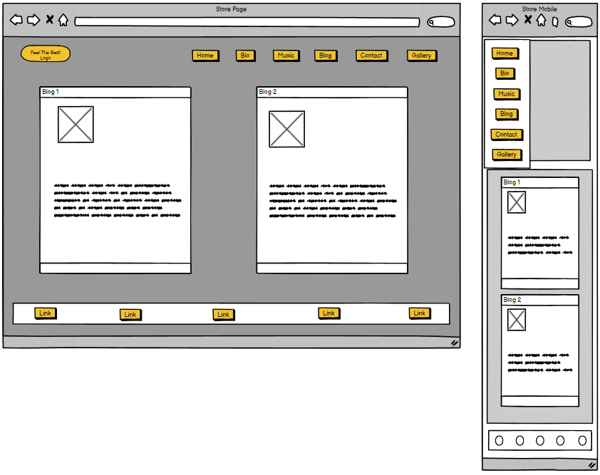

# Band Grooves (PP5 Paul Gleeson: Code Institute)

# Project Links
* [Band Grooves Repository](https://github.com/Shaga-Matula/Band-Grooves)
* [Band Grooves Heroku Site](https://bandgrooves-0de2aec37e72.herokuapp.com)

# Project Discription

* Blue Pulse is a band that creates soulful music that touches the heart and soul of its listeners. The official website of the band offers a range of features that cater to the needs of its fans and potential new listeners. 

* The website has a menu with different sections, including Home, Bio, Music, Store, Blog, and Contact. 

* The Home section is the landing page of the website, where you can find a brief introduction to the band and their latest news. 

* The Bio section provides a detailed history of the band, their members, and their musical influences. 

* The Music section contains our latest tracks and links to our music on various platforms, making it easy for fans to access their music. 

* In the Store section, fans can buy their merchandise, including t-shirts, posters, and CDs, to show their support for the band. 

* The Blog section is where the band shares their thoughts on music, life, and everything in between, providing a glimpse into their personal lives and creative process. 

* Finally, in the Contact section, fans can send them a message, book them for a gig, or just say hello, making it easy for fans to connect with the band. 

* The website is designed to provide a comprehensive overview of the band and their music to their fans and potential new listeners, making it easy for them to stay up-to-date with the band's latest news and events.

# Design 
* (Please note this is a MVP and color and framing may change during the project)

## Blue Pulse Design Goals

### When designing this website for the music band Blue Pulse, its best to keep in mind the band's personality and the mood of their music. Here are some design principles that will be applied to Blue Pulse's website:

* Use Simple Backgrounds: The best music website designs often feature simple backgrounds, with the content customized to fit an artist's personality and the mood of their music.

* Showcase Professional Photos: Blue Pulse will use professional photos to showcase the band's image and personality.

* Add Clear Call-to-Action: Attention is fleeting, so it is important to choose one important thing to highlight and add a clear call-to-action.

* Customize the Template: Blue Pulse will customize the website template to reflect the band's personality and style.

* Design for Responsive Viewing: The website will be designed to be responsive, meaning it will be easily accessible and viewable on different devices, including desktops, laptops, tablets, and smartphones.

* Ensure Easy Navigation: The website will have a clear and easy-to-use navigation menu that allows users to quickly find what they are looking for.

* Maintain Consistent Branding: The website will have consistent branding, including the use of the band's logo, colors, and fonts.

* Create Engaging Content: Blue Pulse will create engaging content, including the band's latest news, music, and merchandise. The blog section will provide a glimpse into the band's personal lives and creative process.

* Integrate Social Media: The website will be integrated with the band's social media accounts, making it easy for fans to follow and engage with the band on different platforms.

* Overall, the design of Blue Pulse's website will reflect the band's personality and style, while providing a comprehensive overview of the band and their music to their fans and potential new listeners. By using "will" instead of "should," the band is making a commitment to take action and achieve their goals in designing their website.

## Blue Pulse Balsamic Mockup 
* Blue Pulse's website will have a unique design that includes balsamic drawings to showcase the band's personality and style. The website will have different sections, including Home, Bio, Music, Store, Blog, and Contact. Here is a description of each section:

### Landing Page/Home: 
* The landing page Balsamic Drawing: This page reflects the mood and personality of the band. It will also include a brief introduction to the band and their latest news.

### Bio Page
*  Bio Balsamic Drawing: This page showcases the band's history, members, and musical influences. It will provide a detailed overview of the band's journey and how they got to where they are today.

### Music Page
* Music Page Balsamic Drawing: This page reflects the mood and style of the band's music. It will contain their latest tracks and links to their music on various platforms, making it easy for fans to access their music.

### Store Page
* Store Page Balsamic Drawing : In this section, fans can buy their merchandise, including t-shirts, posters, and CDs, to show their support for the band. The balsamic drawing helps to showcase the band's merchandise and reflect their style during devolopment.

### Blog Page
* Blog Page Balsamic Drawing : This section will have a page that reflects the band's personal lives and creative process. It is where the band shares their thoughts on music, life, and everything in between using the guid of Balsamic Drawings.

### Contact Page
*  Contacts Page Balsamic Drawing: In this section, fans can send them a message, book them for a gig, or just say hello, making it easy for fans to connect with the band. The balsamic drawing will help devolop the page to reflect the band's personality and style.

### Overall, the design of Blue Pulse's website using balsamic drawings as a design tool will guide and reflect the band's personality and style, while providing a comprehensive overview of the band and their music to their fans and potential new listeners.

### COLOR Pallet

* Thankyou to HookAgency for Pallett idea. 
* [Link to HookAgency](https://hookagency.com/blog/web-design-color-palettes/)

.dark-gold {color: #8E793E}

.light-gold {color: #AD974F}

.intellectual-grey {color: #231F20}

.light-grey {color: #EAEAEA}